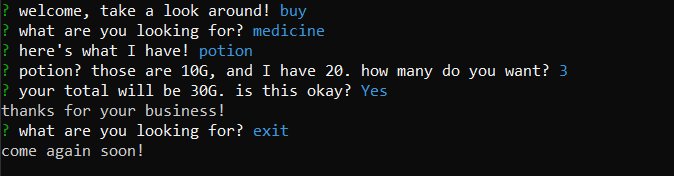

# Welcome!

## Overview

This is a node application designed to emulate an online store. It keeps track of total stock, and allows the user to purchase items as long as the amount requested is available. I like games, so to keep it interesting I made it more like an RPG shop instead stocking it like a normal store.

---

## Requirements

You'll need both the `inquirer` and `mysql` node packages, so make sure to install them.
Next, run `shopkeep.sql` to create the database we'll be using.

```javascript
$ npm i // the included package.json will help make this work
```

## How it Works

```javascript
$ node customer.js
```

Just like you'd expect, you'll be prompted to enter the store, select a category and an item that you'd like to purchase, and then say how many you want. Since we're not actually paying for anything here(oh no D:), the app won't keep track of your money, so feel free to buy out everything in the store.

Basically, it'll look like this:



Or, watch a short run-through of the app [_**here**_](https://youtu.be/m3u3f-hR3SQ):

## Known Bugs

- None :D (but let me know if you see any!)
